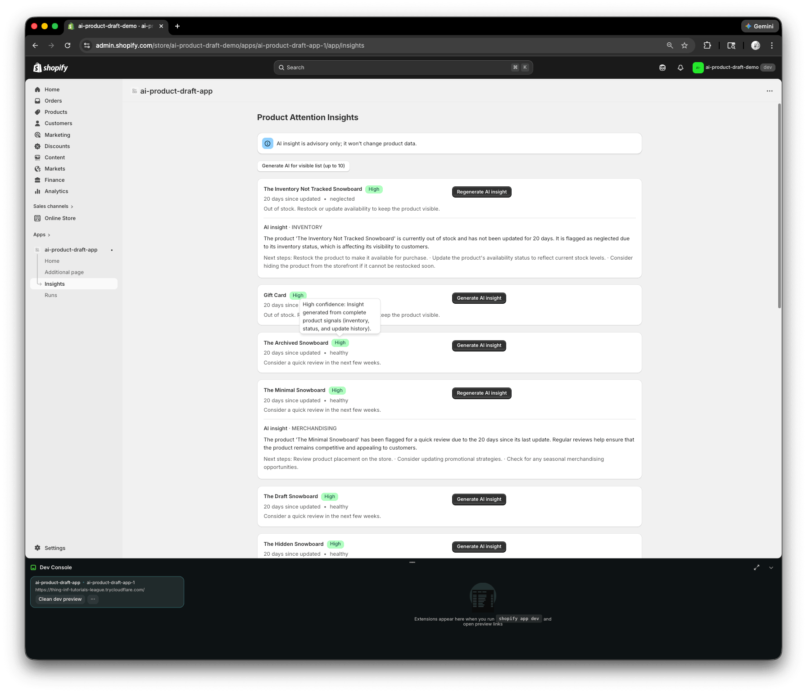
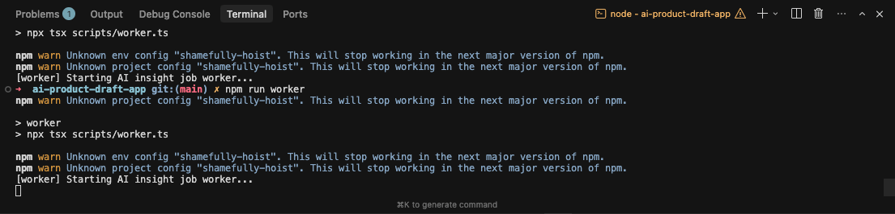

# Product Attention Insights

Embedded Shopify Admin app that helps store owners identify which products need attention.

Built with the official Shopify App template using React Router, Polaris, Prisma, Admin GraphQL, background jobs, and structured AI integration.

---

## The Problem

Store owners often don’t know which products need review.

Products can quietly become:

* Out of stock
* Left in draft
* Hidden unintentionally
* Not updated in months
* Poorly merchandised

Most stores lack a lightweight operational dashboard to surface these signals.

---

## The Solution

Product Attention Insights is an embedded Shopify Admin app that:

* Fetches products via Shopify Admin GraphQL
* Computes operational “attention signals” (e.g. days since updated, inventory state, status)
* Assigns a severity level (Low / Medium / High)
* Generates structured AI explanations for why a product may need attention
* Runs AI work asynchronously via a background job worker
* Tracks job runs with status + retry handling
* Verifies Shopify webhooks with HMAC and idempotency
* Cleans up shop data securely on uninstall

The app is advisory-only and does not modify product data.

🎥 Demo Video
👉 Watch the demo here:
https://www.loom.com/share/925ddabdca89459d8d1e1e7b327b0f1c

## Screenshots

### Insights Dashboard (AI + Confidence Badge)



---

### Async Job Worker Running




---

## What This Project Demonstrates

This project is intentionally structured to showcase production-level Shopify app patterns.

### Shopify Platform

* OAuth authentication
* Server-side session storage
* Admin GraphQL integration
* Embedded app using Polaris
* Verified webhooks with HMAC validation
* Idempotent webhook processing

### Architecture

* Prisma ORM with structured models
* Async job queue with retry + backoff
* Background worker process
* Run-level observability
* Separation of concerns:

  * `/server/shopify`
  * `/server/ai`
  * `/server/jobs`
  * `/server/webhooks`

### AI Integration

* Structured JSON contract (no freeform hallucinated output)
* Strict prompt constraints
* Limited safe input fields
* Human-in-the-loop design (no auto-writes to Shopify)
* Retry handling and error state persistence

### Operational Maturity Signals

* Background processing instead of blocking requests
* Job state tracking (QUEUED → RUNNING → SUCCEEDED / FAILED)
* Run-level summaries
* Reversibility and non-destructive behavior
* Clear UI status and confidence indicators

---

## Core Features

### Insights Page

* Displays products with computed attention signals
* Severity badge (Low / Medium / High)
* Optional AI-generated explanation
* “Generate AI insight” per product
* Bulk generate for visible list (up to 10)

### Async Job Processing

* Jobs stored in database
* Worker polls queue
* Retry with exponential backoff
* Run tracking for grouped operations

### Runs Page

* Lists historical runs
* Shows product-level success / failure
* Displays counts and timestamps

### Webhook Handling

* `app/uninstalled`
* HMAC verification
* Idempotency via webhook ID
* Secure cleanup of shop data

---

## Tech Stack

* TypeScript
* React Router
* Shopify Polaris
* Shopify Admin GraphQL API
* Prisma ORM
* SQLite (dev)
* Background worker (tsx)
* OpenAI API (structured JSON mode)

---

## Architecture Overview

High-level flow:

1. Merchant installs app via OAuth
2. Products fetched via Admin GraphQL
3. Signals computed and stored in Prisma
4. AI insight request enqueues a job
5. Worker claims job and calls OpenAI
6. Structured output validated and stored
7. UI reflects status and explanation
8. Runs page tracks grouped activity
9. Webhooks verified and handled securely

---

## How To Run Locally

Requirements:

* Node 18+
* Shopify Partner account
* Development store
* OpenAI API key (optional but required for AI insight generation)

Install dependencies:

```
npm install
```

Create environment file:

```
cp .env.example .env
```

Add your OpenAI key:

```
OPENAI_API_KEY=sk-...
```

Run the app:

Terminal 1:

```
npm run dev
```

Terminal 2:

```
npm run worker
```

Install the app on your dev store, then navigate to:

Apps → Product Attention Insights → Insights

---

## Design Decisions

### Advisory-Only AI

The app does not modify product descriptions or metadata.
AI is used for explanation and prioritization only.

Reason: Responsible AI integration and reduced operational risk.

---

### Async Job Queue Instead of Inline AI Calls

AI calls are processed in a background worker.

Reason:

* Avoid blocking requests
* Enable retries
* Improve resilience
* Reflect real-world production patterns

---

### Structured JSON Output

The AI must return:

* summary
* actionType
* nextSteps
* optional caveats

Reason:

* Predictable UI rendering
* Safer integration
* Reduced hallucination risk

---

### Hard Scope Constraints

* Max 10 products per batch
* No storefront theme extensions
* No analytics dashboards
* No automated product writes

This keeps the project focused and production-realistic.

---

## Why This Project Exists

This project was built to demonstrate:

* Deep Shopify platform knowledge
* Async architecture competency
* Secure webhook handling
* Responsible AI integration
* Production-aware design decisions

It is intentionally structured to reflect real-world app architecture rather than a simple demo.

---
